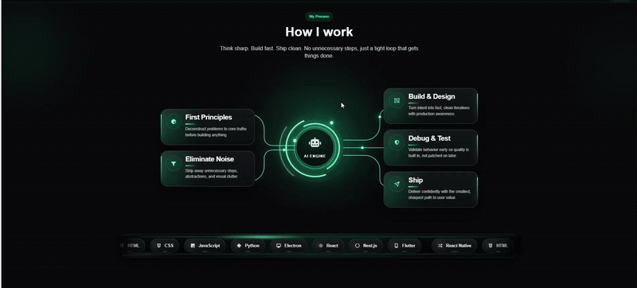

# Process Animation Effects

## Introduction

Recently, while developing my personal website, I designed a set of animation effects for the workflow demonstration section, including scroll-in animations, core rotation, process line flow, and other effects. These animations not only enhance the visual appeal of the page but also improve the user experience.

This article will share how I implemented these animation effects, as well as my thoughts and insights during the production process.



## Technical Choices

### Animation Tech Stack

- **CSS Animations**: Using `@keyframes` to define basic animations
- **AOS Library**: Implementing scroll-triggered entry animations
- **SVG**: Creating process lines and path animations
- **CSS Transitions**: Implementing hover effects

### Design Approach

I wanted to convey the fluidity and technological feel of the workflow through animations, so I chose:

- Smooth scroll-in effects
- Core area rotation and pulse animations
- Process line flow effects
- Dynamic display of tech stack
- Card interaction feedback

## Animation Implementation

### Scroll-in Animations

**Implementation Method**:

- Using AOS library, configuring animation types via `data-aos` attribute
- Setting different `data-aos-delay` to achieve sequential entry of elements
- Choosing animation types like `fade-up`, `fade-left` to maintain a unified style

**Key Code**:

```html
<div class="text-center max-w-4xl mx-auto mb-16" data-aos="fade-up" data-aos-delay="100">
    <!-- Title content -->
</div>

<article class="process-card" data-aos="fade-left" data-aos-delay="120">
    <!-- Card content -->
</article>
```

**Production Insights**:

- The delay time for entry animations needs careful adjustment to avoid being too mechanical
- Choosing animation directions that match the content enhances visual hierarchy

### Core Rotation Animation

**Implementation Method**:

- Creating multiple nested ring elements
- Using `process-spin` animation to achieve rotation effect
- Setting different rotation speeds and directions for different rings
- Adding pulse effects to enhance technological feel

**Key Code**:

```css
.process-core-ring-1 {
    width: 15.8rem;
    height: 15.8rem;
    border-color: rgba(0, 245, 160, 0.1);
    animation: process-spin 34s linear infinite reverse;
}

.process-core-ring-2 {
    width: 12.7rem;
    height: 12.7rem;
    border-style: dashed;
    border-color: rgba(109, 255, 214, 0.34);
    animation: process-spin 20s linear infinite;
}
```

**Production Insights**:

- Multi-layer ring structures require precise positioning and size calculations
- Different rotation speeds can create more丰富 visual effects
- The speed of pulse animations should be moderate to avoid too frequent changes

### Process Line Flow Animation

**Implementation Method**:

- Using SVG to create process paths
- Specifying point movement paths via `offset-path` attribute
- Using `process-flow-move` animation to control point movement
- Multiple points starting with different delays to form a continuous flow effect

**Key Code**:

```css
.process-flow-dot-1 {
    offset-path: path("M 250,135 H 350 C 385,135 408,160 408,194 V 222 C 408,240 420,252 440,252 H 515");
    animation: process-flow-move 4.2s linear infinite;
}

@keyframes process-flow-move {
    0% {
        offset-distance: 0%;
        opacity: 0;
        transform: scale(0.5);
    }
    10% {
        opacity: 1;
        transform: scale(1);
    }
    90% {
        opacity: 1;
        transform: scale(1);
    }
    100% {
        offset-distance: 100%;
        opacity: 0;
        transform: scale(0.5);
    }
}
```

**Production Insights**:

- SVG path design needs to consider overall layout and visual guidance
- Changes in point size and opacity can enhance the sense of flow
- The delay times for multiple points need to be calculated to ensure natural flow effects

### Tech Stack Scroll Animation

**Implementation Method**:

- Using two identical track elements
- Applying `process-marquee` animation to achieve horizontal scrolling
- Implementing infinite loop effect via `transform: translateX`
- Adding track sweep effects to enhance visual impact

**Key Code**:

```css
.process-stack-marquee {
    display: flex;
    width: max-content;
    gap: 1.15rem;
    animation: process-marquee 22s linear infinite;
    will-change: transform;
}

@keyframes process-marquee {
    from {
        transform: translateX(0);
    }
    to {
        transform: translateX(calc(-50% - 0.5rem));
    }
}
```

**Production Insights**:

- Infinite scrolling implementation requires precise calculation and layout
- The scrolling speed should be moderate, providing a dynamic feel without affecting readability
- Sweep effects can enhance the visual appeal of the tech stack

### Card Hover Effects

**Implementation Method**:

- Using `transition` property to define transition effects
- Controlling transitions of multiple properties, including `transform`, `border-color`, `box-shadow`, etc.
- Setting different hover effects for cards and icons

**Key Code**:

```css
.process-card {
    transition:
        transform 0.35s ease,
        border-color 0.35s ease,
        box-shadow 0.35s ease,
        background-color 0.35s ease;
}

.process-card:hover {
    border-color: rgba(109, 255, 214, 0.28);
    background:
        linear-gradient(180deg, rgba(24, 31, 34, 0.97), rgba(14, 18, 20, 0.94)),
        rgba(19, 23, 25, 0.95);
    box-shadow:
        0 32px 74px rgba(0, 0, 0, 0.36),
        0 0 0 1px rgba(109, 255, 214, 0.05) inset,
        0 0 28px rgba(0, 245, 160, 0.08);
    transform: translateY(-6px);
}
```

**Production Insights**:

- Hover effects need to be natural and smooth, avoiding overly exaggerated changes
- The transition times for multiple properties should be consistent to ensure coordinated overall effects
- Changes in background and border can enhance the card's sense of hierarchy

## Technical Points

### Performance Optimization

- **Using `will-change`**: For scroll animations, use `will-change: transform` to hint the browser to optimize rendering
- **Reducing animated elements**: Avoid using too many animated elements in the page, especially complex animations
- **Using `filter` sparingly**: The `filter` property may affect performance and needs to be used cautiously
- **Optimizing SVG**: Ensure SVG code is concise and avoid unnecessary elements

### Responsive Design

- **Media queries**: Adjust animation effects at different screen sizes
- **Mobile device optimization**: Simplify animations on small screens to improve performance
- **Touch device support**: Provide appropriate interaction feedback for touch devices

### Animation Best Practices

- **Setting appropriate animation duration**: Set suitable animation duration based on animation type and effect
- **Using `prefers-reduced-motion`**: Provide alternatives for users who need reduced animations
- **Prioritizing `transform` and `opacity`**: These two properties have the best animation performance, avoiding triggering reflows

## Production Journey

### Initial Design

Initially, I just wanted to add some simple animation effects to the workflow section to make the page more dynamic. But as the design deepened, I found that by combining different animation effects, I could create a richer visual experience.

### Technical Challenges

During implementation, I encountered several challenges:

- Synchronization issues with multi-layer ring animations
- Path design for SVG path animations
- Animation adjustments in responsive layouts
- Balancing performance optimization

### Solutions

Through document research and continuous testing, I found the following solutions:

- Using different animation durations and delays to create a sense of hierarchy
- Simplifying SVG paths to ensure smooth animations
- Using media queries to adjust animation effects at different screen sizes
- Prioritizing performance-friendly animation properties

### Final Effect

After multiple adjustments and optimizations, the final animation effect met expectations:

- Smooth entry when scrolling
- Technological rotation in the core area
- Natural flow of process lines
- Dynamic display of tech stack
- Card interaction feedback

## Summary

The process of creating process animation effects was a journey of continuous exploration and optimization. By combining CSS animations, AOS library, and SVG technology, I successfully created a set of visually appealing and user-friendly animation effects.

**Learning Insights**:

- Animation effects need to match the content and overall design style
- Details determine success, and animation speed, delay, and effects all need careful adjustment
- Performance optimization is an indispensable part of animation design
- Responsive design needs to consider animation performance on different devices

Through this practice, I gained a deeper understanding of front-end animations and accumulated valuable experience. These animation effects not only enhance the visual experience of the website but also demonstrate the charm of front-end technology.